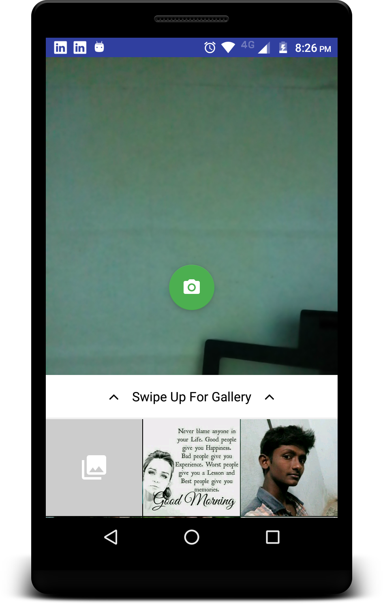
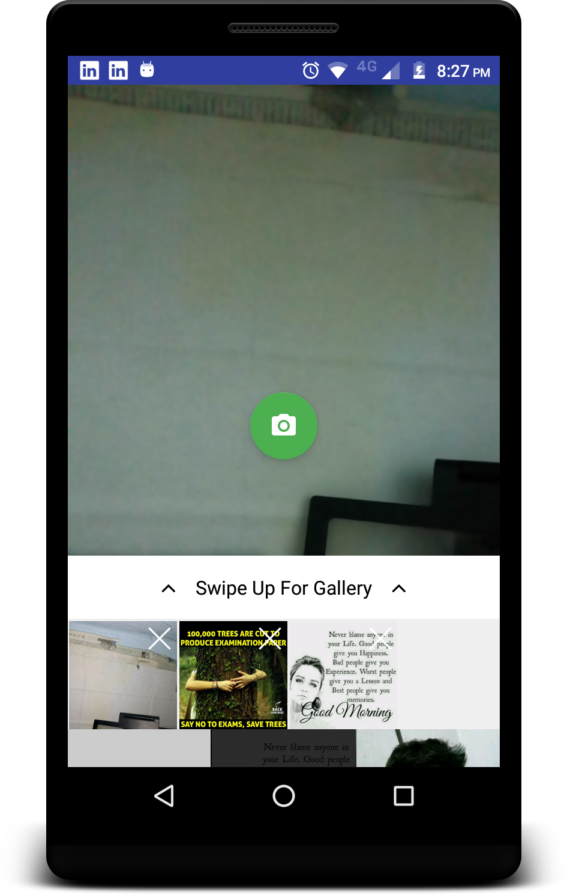
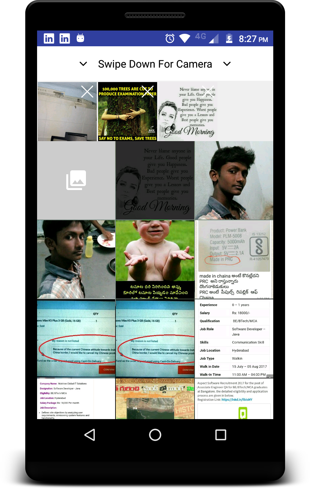

 
Combined both TedBottomPicker and Camera View, to get the View Similar to ImagePickers of Olx.

We can Pick Images From Gallery and Camera in two modes
##### Single 
##### Multi
Can pick multiple images, from both Camera and Gallery 


## Screen Shot

## Single Picker
 

## Multi Picker
  
<br/><br/>


## Thanks 
* [Flipboard-bottomsheet](https://github.com/Flipboard/bottomsheet) - Android component which presents a dismissible view from the bottom of the screen
* [TedBottomPicker](https://github.com/ParkSangGwon/TedBottomPicker)
* [cameraview](https://github.com/google/cameraview)
* [TedPermission](https://github.com/ParkSangGwon/TedPermission)


<br/><br/>


## License 
 ```code
Copyright 2017 Ramesh Bhupathi

Licensed under the Apache License, Version 2.0 (the "License");
you may not use this file except in compliance with the License.
You may obtain a copy of the License at

http://www.apache.org/licenses/LICENSE-2.0

Unless required by applicable law or agreed to in writing, software
distributed under the License is distributed on an "AS IS" BASIS,
WITHOUT WARRANTIES OR CONDITIONS OF ANY KIND, either express or implied.
See the License for the specific language governing permissions and
limitations under the License.```
